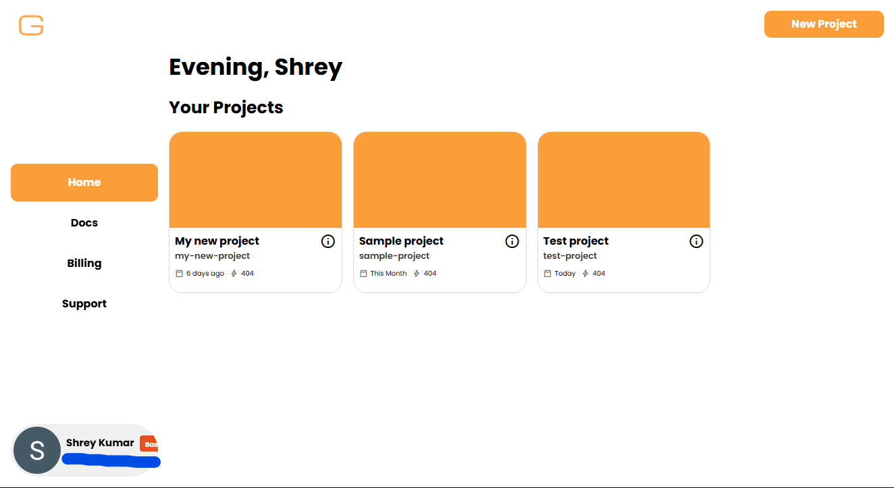
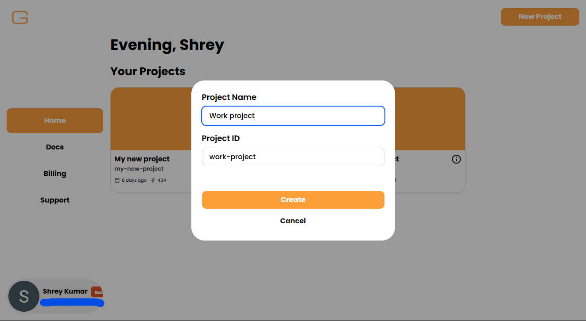

# **Setup Genstack**

Before using Genstack in code, you’ll need to activate your account and get your API key from the Genstack web app.

---

## **Sign in to Genstack**

Head over to [Genstack](https://genstack.fly.dev) and sign in with your Google account or email.

---

## **Create a Project**

Once logged in:

- Go to the **Home** tab

- Click **New Project**

- Give it a name and hit **Create**

Each project keeps its own API key and usage.

---

